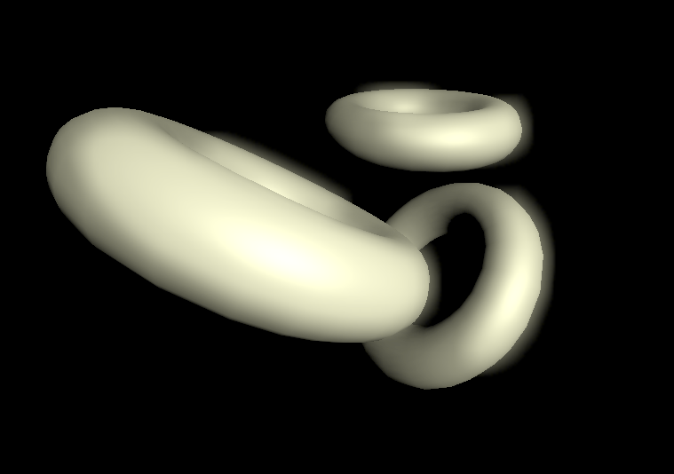

# DirectX 11 Bloom Post-processing

I recently needed to work on some existing legacy DirectX 11 rendering code involving compute shaders. Since I had only used OpenGL and Vulkan before, I played around with DirectX 11 to become familiar with the API and therefore implemented this little mesh rendering with a post-processing effect involving compute shaders.

The code uses the [tinyobjloader](https://github.com/syoyo/tinyobjloader) library to load an example mesh, which is rendered to an offscreen-texture with the standard Blinn-Phong lighting model implemented in the pixel shader. The result is afterwards thresholded and downsampled using a compute shader. Then two consecutive Gaussian filtering passes (horizontal and vertical) are applied using another compute shader. The final output image is then obtained by rendering a screen-aligned quad and combining the original image with the thresholded, downsampled and blurred image. Here is an example of the result:

## Dependencies

A solution for Visual Studio 2019 is included. In order to compile and run the code, you need to install Microsoft's [DirectX SDK](https://www.microsoft.com/en-us/download/details.aspx?id=6812). Note that the paths in the solution are set to the standard include and library paths. If you have the SDK installed in a different location, you need to adapt the project settings.

The tinyobjloader header is already included.

Tested on Windows 7 and Visual Studio 2019 with an NVidia GTX 1070.
